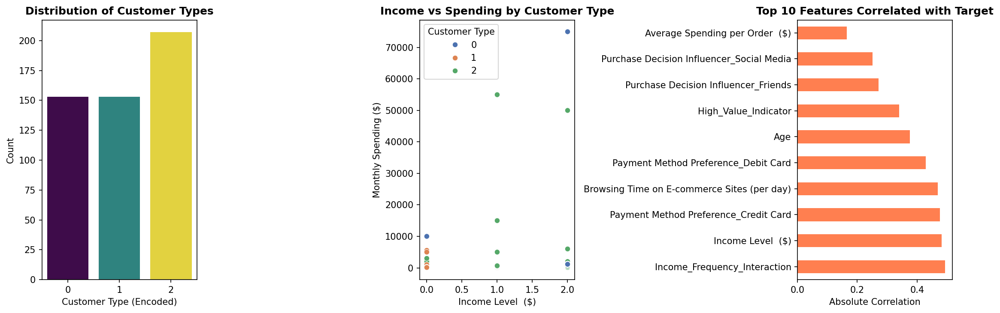
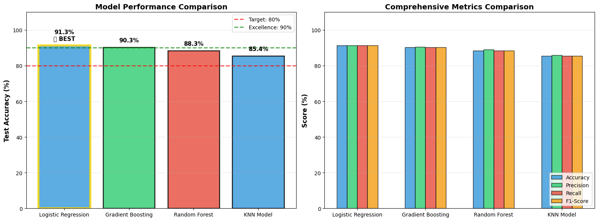
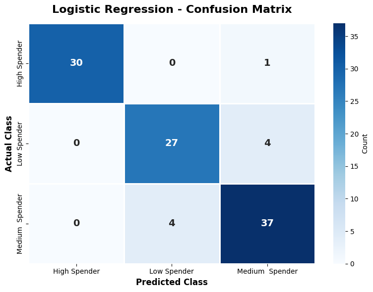
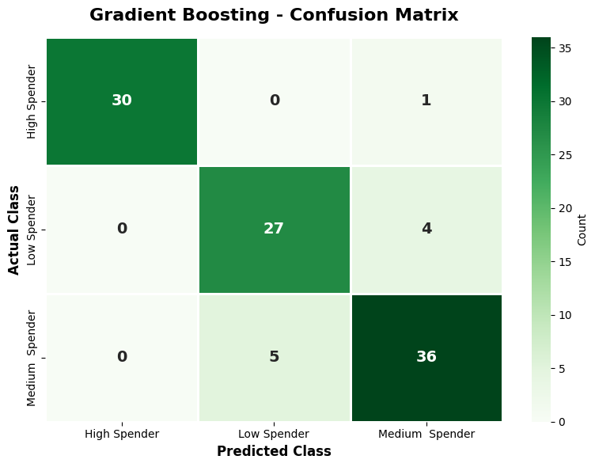
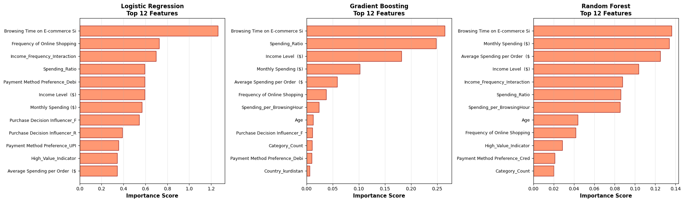
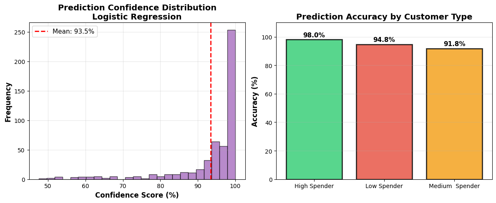

# 🛍️ E-Commerce Customer Spending Classification

[](https://www.python.org/)
[](https://scikit-learn.org/)
[](LICENSE)

> **An AI-powered predictive analytics system that classifies e-commerce customers into High, Medium, and Low spenders using multiple machine learning algorithms.**

---

## 📋 Table of Contents

- [Overview](#overview)
- [Key Features](#key-features)
- [Dataset](#dataset)
- [Models Implemented](#models-implemented)
- [Project Structure](#project-structure)
- [Installation](#installation)
- [Usage](#usage)
- [Results](#results)
- [Model Performance](#model-performance)
- [Visualizations](#visualizations)
- [Technologies Used](#technologies-used)
- [Author](#author)

---

## 🎯 Overview

This project implements a comprehensive machine learning pipeline for customer segmentation in e-commerce. By analyzing customer behavior patterns, spending habits, and demographic information, the system classifies customers into three categories:

- **🔥 High Spender**: Premium customers with high purchasing power
- **⚠️ Medium Spender**: Regular customers with moderate engagement
- **✅ Low Spender**: Occasional buyers with minimal activity

The project demonstrates end-to-end ML workflow including data preprocessing, feature engineering, model training, evaluation, and deployment-ready predictions.

---

## ✨ Key Features

- **Complete Data Pipeline**: From raw data to production-ready models
- **Advanced Feature Engineering**: 5 custom features created for better predictions
- **Multi-Model Comparison**: 4 different ML algorithms compared
- **Comprehensive EDA**: Visual analysis of patterns and correlations
- **Cross-Validation**: 3-fold CV for reliable performance estimates
- **Production Ready**: Generates predictions with confidence scores
- **Beautiful Visualizations**: Professional charts and confusion matrices

---

## 📊 Dataset

### Source
E-commerce customer transaction and behavior data

### Features (Total: 27 after preprocessing)

**Demographic:**
- Age, Gender, Country, Income Level

**Behavioral:**
- Monthly Spending ($)
- Average Spending per Order ($)
- Frequency of Online Shopping (Rarely/Monthly/Weekly/Daily)
- Browsing Time on E-commerce Sites (per day)
- Payment Method Preference
- Purchase Decision Influencer

**Engineered Features:**
- `Category_Count`: Number of product categories interested in
- `Spending_Ratio`: Orders per month ratio
- `Spending_per_BrowsingHour`: Spending efficiency metric
- `Income_Frequency_Interaction`: Income × Shopping frequency
- `High_Value_Indicator`: Binary flag for premium customers

### Target Variable
**Customer Type**: High Spender / Medium Spender / Low Spender

### Data Distribution

*Figure 1: Customer type distribution and feature correlations*

---

## 🤖 Models Implemented

### 1. **Logistic Regression** 
- ✅ Fast inference and interpretable
- ✅ Excellent for linear decision boundaries
- 🎯 **Test Accuracy: 91.26%** (BEST MODEL)

### 2. **Gradient Boosting** 
- ✅ Sequential ensemble learning
- ✅ Captures complex non-linear patterns
- 🎯 **Test Accuracy: 90.29%**

### 3. **Random Forest** 
- ✅ Robust bagging ensemble
- ✅ Handles overfitting well
- 🎯 **Test Accuracy: 88.35%**

### 4. **K-Nearest Neighbors** 
- ✅ Non-parametric and simple
- ✅ Effective for pattern recognition
- 🎯 **Test Accuracy: 85.44%**

---

## 📁 Project Structure

```
Predictive-Project/
│
├── 📓 myself.ipynb              # Main Jupyter Notebook (complete analysis)
├── 🐍 myself.py                 # Python script version
├── 📊 Dataset.csv               # Training dataset
├── 📈 customer_predictions.csv # Model predictions output
│
├── 🖼️ Visualizations/
│   ├── eda_analysis.png         # Exploratory Data Analysis
│   ├── best_model_analysis.png # Model comparison charts
│   ├── Img2.png - Img8.png     # Additional analysis visualizations
│
├── 📄 README.md                 # Project documentation
├── 🚫 .gitignore               # Git ignore rules
└── 📜 12318015(Mansi Tyagi) K23BE.pdf  # Academic report
```

---

## 🚀 Installation

### Prerequisites
- Python 3.8 or higher
- pip package manager

### Step 1: Clone the Repository
```bash
git clone https://github.com/mansityagi01/Predictive-Project.git
cd Predictive-Project
```

### Step 2: Install Dependencies
```bash
pip install pandas numpy matplotlib seaborn scikit-learn jupyter
```

### Step 3: Run the Notebook
```bash
jupyter notebook myself.ipynb
```

Or run the Python script:
```bash
python myself.py
```

---

## 💻 Usage

### Option 1: Jupyter Notebook (Recommended)
```python
# Open myself.ipynb and run all cells sequentially
# The notebook includes:
# - Data loading and preprocessing
# - EDA visualizations
# - Feature engineering
# - Model training (4 models)
# - Performance comparison
# - Predictions generation
```

### Option 2: Python Script
```bash
python myself.py
# Output: All visualizations + customer_predictions.csv
```

### Generated Outputs

1. **customer_predictions.csv**: Contains predictions for all customers with confidence scores
2. **Multiple Visualizations**: 
   - Confusion matrices for each model
   - Feature importance charts
   - Model comparison plots
   - Confidence distribution graphs

---

## 📈 Results

### Model Performance Summary

| Model | CV Accuracy | Test Accuracy | Precision | Recall | F1-Score |
|-------|-------------|---------------|-----------|--------|----------|
| **Logistic Regression** 🏆 | 90.49% | **91.26%** | 91.38% | 91.26% | 91.31% |
| **Gradient Boosting** | 88.05% | 90.29% | 90.44% | 90.29% | 90.35% |
| **Random Forest** | 88.54% | 88.35% | 89.01% | 88.35% | 88.44% |
| **K-Nearest Neighbors** | 84.14% | 85.44% | 85.98% | 85.44% | 85.44% |

### 🏆 Best Model: Logistic Regression
- **Test Accuracy**: 91.26%
- **Overall Dataset Accuracy**: 94.54%
- **Status**: ✅ READY FOR DEPLOYMENT


*Figure 2: Performance metrics comparison across all models*

---

## 📊 Visualizations

### 1. Exploratory Data Analysis
- Customer type distribution
- Income vs Spending patterns
- Top 10 correlated features

### 2. Model-Specific Insights
- **Confusion Matrices**: For each of the 4 models
- **Feature Importance**: Top 12 influential features
- **ROC Curves**: Model discrimination ability

### 3. Prediction Analysis
- Confidence score distribution
- Class-wise accuracy breakdown
- Prediction probability heatmaps

### Sample Visualizations

<table>
<tr>
<td></td>
<td></td>
</tr>
<tr>
<td align="center"><b>Feature Correlations</b></td>
<td align="center"><b>Model Performance</b></td>
</tr>
<tr>
<td></td>
<td></td>
</tr>
<tr>
<td align="center"><b>Feature Importance</b></td>
<td align="center"><b>Best Model Performance</b></td>
</tr>
</table>

---

## 🛠️ Technologies Used

### Programming & Libraries
- **Python 3.8+**: Core programming language
- **Pandas**: Data manipulation and analysis
- **NumPy**: Numerical computations
- **Scikit-learn**: Machine learning algorithms
- **Matplotlib & Seaborn**: Data visualization

### Machine Learning Techniques
- **Supervised Learning**: Classification algorithms
- **Feature Engineering**: Custom feature creation
- **Cross-Validation**: K-Fold validation (k=3)
- **Ensemble Methods**: Random Forest, Gradient Boosting
- **Model Evaluation**: Accuracy, Precision, Recall, F1-Score

### Tools
- **Jupyter Notebook**: Interactive development
- **Git & GitHub**: Version control
- **Markdown**: Documentation

---

## 🎓 Academic Context

This project demonstrates practical application of machine learning concepts from:

- **Unit I**: Data Preparation & Preprocessing
- **Unit II**: Logistic Regression (Supervised Learning)
- **Unit III**: Classification & Model Evaluation
- **Unit IV**: Instance-Based Learning (KNN)
- **Unit VI**: Boosting, Random Forests & Cross-Validation

---

## 🔍 Key Insights

### Top 3 Features for Prediction
1. **Monthly Spending ($)** - Primary indicator
2. **Income_Frequency_Interaction** - Combined behavioral metric
3. **Average Spending per Order ($)** - Transaction value indicator

### Business Implications
- **High Spenders**: Focus on retention and premium services
- **Medium Spenders**: Target for upselling campaigns
- **Low Spenders**: Engagement and conversion strategies

---

## 📝 Future Enhancements

- [ ] Deploy as REST API using Flask/FastAPI
- [ ] Create interactive dashboard with Streamlit
- [ ] Implement deep learning models (Neural Networks)
- [ ] Add time-series analysis for trend prediction
- [ ] Integrate real-time prediction system
- [ ] Add explainability with SHAP values

---

## 👨‍💻 Author

**Mansi Tyagi**
- 📧 Email: [mansityagi472@gmail.com](mansityagi472@gmail.com)
- 🔗 GitHub: [@mansityagi01](https://github.com/mansityagi01)
- 💼 LinkedIn: [[mansi011](https://www.linkedin.com/in/mansi011/)]

**Student ID**: 12318015 (K23BE)


## 🙏 Acknowledgments

- Dataset sourced from e-commerce transaction records
- Inspired by real-world customer segmentation use cases
- Built as part of Machine Learning course project

---

## 📞 Contact & Support

For questions, suggestions, or collaboration opportunities:
- 🐛 **Issues**: Open an issue on GitHub
- 💬 **Discussions**: Start a discussion in the repository


---

<div align="center">

### ⭐ Star this repository if you find it helpful!

**Made with ❤️ using Python and Machine Learning**

</div>
